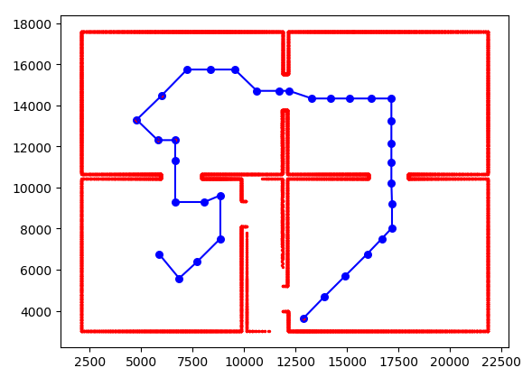
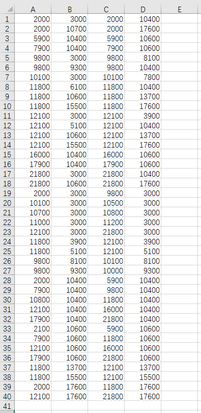

# 代码说明
任务说明文件和相关数据保存在`./task_related`路径下
## 预备条件
***
- python3
## 开始
***
### 相关库安装
- 安装pandas库(用于读取csv文件)
- 安装numpy(处理矩阵)
- 安装matplotlib(用于本任务绘图)
``````
pip install pandas
pip install numpy
pip install matplotlib
``````

### 测试
- 输入数据文件保存在`./data/input`路径下
- 进行测试，task1_display和task5_mapping方法分别针对任务一和任务五
```
python main.py
```

- 任务一图像绘制结果会直接展示，任务五墙壁映射输出保存在`./data/output`路径下

## 结果展示
***
- 任务一结果



- 任务五结果



- 结果说明
  - 任务一图中，蓝色线为无人机飞行轨迹，蓝色点为无人机GPS定位点，红色墙壁由多个雷达扫描点组成
  - 任务五图中，一行为一组坐标，其中A列为x_start，B列为y_start, C列位x_end，D列为y_end
  - 任务五的数据对应任务一种的红色墙壁，其中两个房间连接处较短的线段也被认为是一面墙壁，映射结果与图片展示结果是对应的

## 解决方案
***
- 任务一
  - 读取GPS坐标，使用matplotlib库实现绘制飞行轨迹
  - 读取雷达扫描信息，根据角度将据墙壁的距离映射到x和y轴上，与对应GPS坐标相加获得扫描点的坐标，使用matplotlib将所有扫描点进行绘制即可得到墙壁
  - 注意本任务中GPS坐标和雷达扫描坐标x轴一致，y轴方向相反
- 任务五
  - 从任务一中获取墙壁雷达扫描点的坐标，因为扫描点存在误差，因为忽略掉坐标的小数位和个十位，使同一面墙的扫描点位于同一直线上
  - 观察数据，墙壁只有x轴和y轴两个走向，分别按y轴方向和按x轴方向检测墙壁，以y轴方向为例
  - 扫描点坐标矩阵进行排序，使其按照x坐标由小到大排列，当x坐标相同时，按照y坐标大小进行由小到大排列
  - 遍历排序后的矩阵，将第一个点的坐标设置给x_start,y_start，遍历的过程中进行两种情况的判断：
  - 判断1(x坐标变化)：
    - 当前点与上一个点x坐标是否相等，因为在检索y轴走向墙壁，x坐标不相等则为不同墙壁
    - 如不相等，继续判断上一坐标点的坐标与x_start,y_start的值是否相等以排除x轴走向墙壁的情况
    - 当前点x坐标与上一点不同且上一点坐标与x_start,y_start不同，说明上一个点为墙壁的结束点，将上个点的坐标设置给x_end,y_end，将当前x_start,y_start，x_end,y_end进行保存，将当前点的坐标设置给x_start,y_start，继续遍历
  - 判断2(y坐标的差值)：
    - 当x坐标相同时，y轴差距过大，说明不是同一个墙壁
    - 因为在进行数据预处理时，将坐标个十位和小数点忽略，因此在一个墙壁上的连续点的差值均为100
    - 在遍历的过程中，用当前点y坐标减去上一个点的y坐标，其差值大于100则说明不在同一墙壁上，将上个点的坐标设置给x_end,y_end，将当前x_start,y_start，x_end,y_end进行保存，将当前点的坐标设置给x_start,y_start，继续遍历
  - x轴走向的墙壁探测思路与y轴相同，完成对x和y轴走向墙壁的探测，即可获取墙壁起止坐标的映射